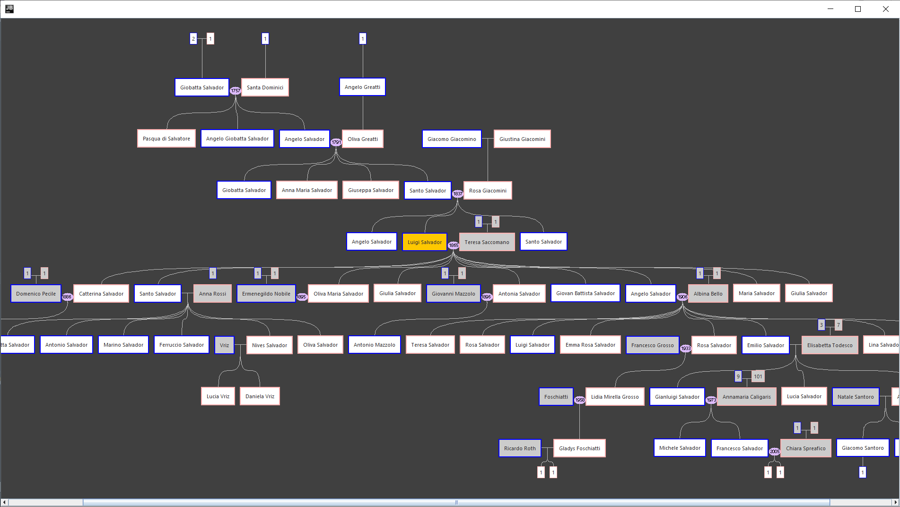

# GedcomGraph canvas

_GedcomGraph canvas_ is a minimal graphical implementation of the Java library [_GedcomGraph_](https://github.com/michelesalvador/GedcomGraph).

_GedcomGraph canvas_ is a Gradle project written with Eclipse, and realized with Java AWT/Swing.

_GedcomGraph canvas_ can open a GEDCOM file (*.ged) and generate a graphic browsable output of a genealogical tree.

This project started on December 2019. 
Author is Michele Salvador, an italian self-taught programmer and genealogy enthusiast.

For questions, problems, suggestions please [open an issue](https://github.com/michelesalvador/GedcomGraph-canvas/issues).