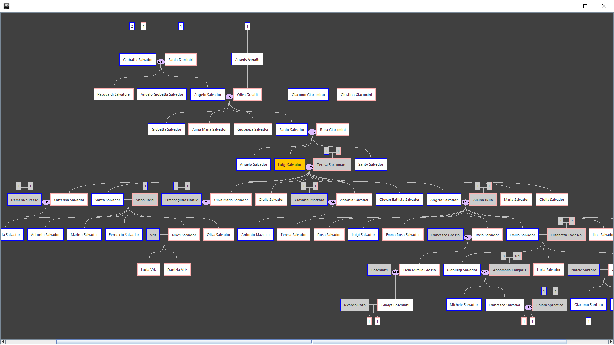

# GedcomGraph Canvas

GedcomGraph Canvas is a minimal graphical implementation of the Java library [GedcomGraph](https://github.com/michelesalvador/GedcomGraph).  
GedcomGraph Canvas can open a GEDCOM file (*.ged) and generate a graphic browsable output of a genealogical tree.

GedcomGraph Canvas is a Gradle project written with IntelliJ IDEA, and realized with Java AWT/Swing.  
The project started on December 2019.  
Version numbering follows that of [GedcomGraph](https://github.com/michelesalvador/GedcomGraph/blob/master/build.gradle).  
Author is Michele Salvador, an italian programmer and genealogy enthusiast.

For questions, problems, suggestions please [open an issue](https://github.com/michelesalvador/GedcomGraph-Canvas/issues).
